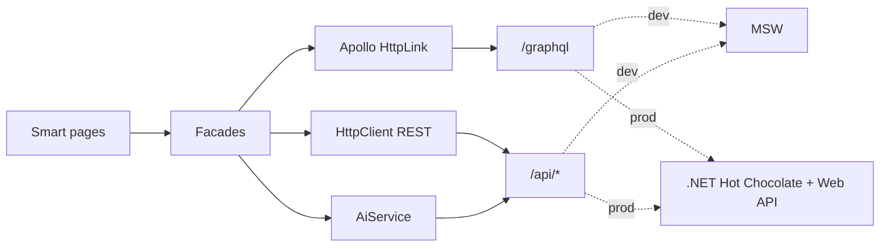

# AI‑assisted Incident & Service Request Dashboard (Angular 21)

Enterprise-style **Angular 21** SPA (standalone, **zoneless** `provideZonelessChangeDetection`, new control flow, `@defer`) that talks to a **.NET GraphQL + REST** backend contract via **Apollo Angular 13** + `HttpClient`. **MSW** mocks both layers so `npm start` works with **no backend**.

## Quick start

```bash
cd ~/Projects/ai-incident-dashboard
nvm use 20   # Angular 21 requires Node ^20.19 / ^22.12 / >=24
npm install
npm start
```

Open `http://localhost:4200`, sign in with any email/password, pick **Agent / Manager / Requester** (MSW returns JWT + user for that role).

## Run with local .NET backend

**JWT note:** In `backend/AiIncident.Api/appsettings.json`, `Jwt:Issuer` and `Jwt:Audience` are **logical names** embedded in access tokens (who issued the token and which client it is meant for). They are **not** folders in this repo. The Angular app lives under `src/`; the audience value is just a string that must match between minting and validation.

1. **One terminal — API + Angular together** (after `npm install`):

```bash
dotnet build AiIncidentDashboard.sln
# In src/environments/environment.development.ts set useMocks: false first.
npm run dev:full
```

This runs the API on `http://localhost:5087` and `ng serve` on `http://localhost:4200` with `proxy.conf.json` forwarding `/graphql` and `/api`.

2. **Or two terminals:**

```bash
dotnet build AiIncidentDashboard.sln
dotnet run --project backend/AiIncident.Api --urls http://localhost:5087
```

Then, with `useMocks: false` in `src/environments/environment.development.ts`:

```bash
npm start
```

## Scripts

| Script        | Purpose                                      |
| ------------- | -------------------------------------------- |
| `npm start`   | Dev server (`ng serve`, MSW on)              |
| `npm run dev:api` | .NET API only (`http://localhost:5087`) |
| `npm run dev:web` | Angular dev server only (`ng serve`) |
| `npm run dev:full` | API + Angular together (set `useMocks: false` for real backend) |
| `npm run build` | Production bundle (`environment.production` replaces `environment.ts`) |
| `npm test` / `npm run test:ci` | Vitest via `ng test`              |
| `npm run codegen` | Regenerate `src/graphql/generated/graphql.ts` from `schema.graphql` |
| `npm run lint` | ESLint (`ng lint`)                          |
| `npm run format` | Prettier write                             |

## Architecture



- **Facades** (`TicketsFacade`, `DashboardFacade`) own GraphQL I/O; components do not call `Apollo` directly.
- **SignalStore** (`AuthStore`, `TicketFiltersStore`) for cross-cutting auth + filters; feature-local state uses `signal` / `computed`.
- **Guards**: `authGuard`, `guestGuard`, `roleGuard`, `homeRedirectGuard`; **preload**: `PreloadAllModules`.
- **AI**: `AiService` calls **only** `/api/ai/*` (no LLM keys in the browser). Toggle with `FEATURE_FLAGS` in [`src/environments/environment.ts`](src/environments/environment.ts).

## Swapping MSW for the real .NET API

1. Set `useMocks: false` in the active environment file.
2. Point URLs:

```ts
graphqlUrl: 'https://your-api.example.com/graphql',
restUrl: 'https://your-api.example.com/api',
```

3. Ensure CORS + JWT (or cookies) match your `authInterceptor` expectations.

No other Angular code changes are required for the happy path.

## GraphQL code generation

Schema: [`schema.graphql`](schema.graphql) (mirrors planned Hot Chocolate types). Operations: [`src/graphql/operations.graphql`](src/graphql/operations.graphql).

After `npm run codegen`, if the generator re-emits **duplicate input types** at the bottom of `graphql.ts`, remove the duplicated block (known `typescript` + `typescript-operations` quirk in a single output file) **or** split outputs using `@graphql-codegen/import-types-preset` (see GraphQL Code Generator docs).

## Security & AI notes

- **PII**: ticket text may contain personal data; only send fields needed for summarization, and process on the server with retention policies.
- **AI as assist**: core ticket lifecycle works if AI endpoints fail; UI shows “AI service unavailable”.

## Extension points (later)

- **Subscriptions**: `graphql-ws` + split link (stubbed; `featureFlags.graphqlSubscriptions`).
- **SSR / PWA**: not enabled (SPA-only by design for v1).
- **Micro-frontends**: feature folders under `src/app/features/*` map cleanly to future remote boundaries.

## Tooling

- **Build**: `@angular/build` (esbuild application builder).
- **Tests**: Vitest + `ApolloTestingModule` for GraphQL integration-style facade tests.

## License

Private / demo — adjust for your org.
